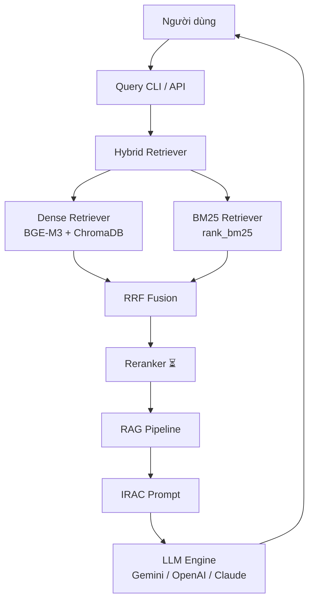

# 🏛️ Kế Hoạch Triển Khai: Trợ Lý Ảo Tư Vấn Pháp Luật Việt Nam

> **Phiên bản**: 1.1 | **Cập nhật lần cuối**: 2026-07-10  
> **Kiến trúc**: RAG Pipeline + Hybrid Retrieval (BM25 + Dense) + IRAC CoT

---

## 📋 Tổng Quan Hệ Thống



---

## 🗂️ Cấu Trúc Thư Mục Dự Án (Thực Tế)

```
VietLegalRag/
├── pyproject.toml
├── .env / .env.example
├── Makefile
├── data/
│   ├── raw/                       # 5,001 văn bản pháp luật gốc (JSON)
│   │   ├── dan_su/ (405)
│   │   ├── dat_dai/ (472)
│   │   ├── doanh_nghiep/ (684)
│   │   ├── giao_duc/ (342)
│   │   ├── giao_thong/ (360)
│   │   ├── hanh_chinh/ (757)
│   │   ├── hinh_su/ (183)
│   │   ├── khac/ (147)
│   │   ├── lao_dong/ (399)
│   │   ├── moi_truong/ (499)
│   │   ├── thue/ (664)
│   │   └── y_te/ (89)
│   ├── processed/                 # Chunks JSONL (cùng cấu trúc 12 domain)
│   ├── index/                     # ChromaDB persistent storage (35,879 vectors)
│   └── eval/
│       ├── questions.v1.jsonl     # 5 câu hỏi kiểm thử cơ bản
│       └── questions.v2.jsonl     # 200 câu hỏi heuristic
├── src/vietnam_legal_rag/
│   ├── config.py                  # Pydantic Settings
│   ├── paths.py                   # Path constants
│   ├── scrapers/                  # Crawler thuvienphapluat.vn
│   ├── ingestion/                 # Loader → Chunker → Enrichment → Pipeline
│   ├── embeddings/                # BGE-M3 Vietnamese embedder
│   ├── vectorstore/               # ChromaDB client
│   ├── retrieval/                 # Dense + BM25 + Hybrid (RRF)
│   ├── generation/                # LLM client + IRAC prompts
│   ├── pipeline/                  # RAGPipeline orchestrator
│   └── eval/                      # Evaluator + Citation checker
├── scripts/                       # CLI tools (12 scripts)
├── tests/                         # Unit + integration tests (5 files)
└── docs/                          # Architecture, roadmap, ablation results
```

---

## 🔧 Tech Stack (Thực Tế)

| Thành phần | Công nghệ | Trạng thái |
|---|---|---|
| **Ngôn ngữ** | Python 3.12 | ✅ |
| **Vector DB** | ChromaDB (persistent) | ✅ |
| **BM25** | rank_bm25 (in-memory) | ✅ |
| **Embedding** | `BAAI/bge-m3` (dim=1024) | ✅ |
| **Reranker** | `bge-reranker-v2-m3` (CrossEncoder) | ✅ |
| **LLM** | Gemini / OpenAI / Claude (qua LangChain) | ✅ |
| **Prompting** | IRAC Chain-of-Thought | ✅ |
| **Config** | Pydantic Settings + .env | ✅ |
| **CLI** | Typer + Rich | ✅ |
| **Graph DB** | Neo4j | ⏳ Chưa triển khai |
| **API Server** | FastAPI | ⏳ Chưa triển khai |
| **Frontend** | Next.js | ⏳ Chưa triển khai |

---

## 📊 Kết Quả Đánh Giá (Ablation Study)

> Trên 200 câu hỏi testset heuristic, đo Recall@5

| Cấu hình | Precision@5 | Recall@5 | Ghi chú |
|---|---|---|---|
| Dense-Only (BGE-M3) | 63.00% | 63.00% | Semantic search |
| BM25-Only | 70.00% | 70.00% | Keyword matching |
| Hybrid (D=0.3, B=0.7) | 68.50% | 68.50% | BM25-heavy |
| Hybrid (D=0.5, B=0.5) | 69.50% | 69.50% | Balanced |
| Hybrid (D=0.6, B=0.4) | 65.00% | 65.00% | Dense-leaning |
| Hybrid (D=0.7, B=0.3) | 65.00% | 65.00% | |
| Hybrid (D=0.8, B=0.2) | 63.50% | 63.50% | ≈ Dense-only |
| **Hybrid+Reranker (D=0.5, B=0.5, Top50→5)** | **74.00%** | **74.00%** | 🏆 **Best** |
| **Hybrid+Reranker (D=0.3, B=0.7, Top50→5)** | **74.00%** | **74.00%** | 🏆 **Best** |

> [!TIP]
> **Key Insight**: Cross-Encoder Reranker nâng Recall từ 70% (BM25-only) lên **74%** (+4 điểm). Reranker hoạt động bằng cách xem xét đồng thời (cross-attention) giữa query và document, lọc bỏ false positives mà cả BM25 lẫn Dense đều bỏ sót.

> [!WARNING]
> **Testset bias**: Câu hỏi heuristic chứa số hiệu văn bản → BM25 exact match chiếm ưu thế. Cần testset LLM-quality (câu hỏi tự nhiên) để benchmark semantic retrieval công bằng hơn.

> [!CAUTION]
> **Production Insight — Hybrid Retrieval (RRF)**:
> Không bao giờ chạy đánh giá (hoặc deploy) Hybrid Retrieval khi bộ chỉ mục Vector và BM25 không đồng bộ về số lượng documents. Nếu Dense Retriever thiếu dữ liệu (chưa index xong), RRF sẽ đẩy các kết quả sai của Dense lên đầu và "đè bẹp" kết quả đúng duy nhất của BM25.

---

## 🚀 Chi Tiết Triển Khai Từng Phase

### Phase 1: Thu Thập & Tiền Xử Lý ✅ HOÀN THÀNH

- [x] Scraper cho `thuvienphapluat.vn` (httpx + selectolax)
- [x] Mass crawl pipeline (5,001 văn bản, 12 lĩnh vực)
- [x] Import HuggingFace dataset adapter
- [x] Lưu trữ 3 tầng: **RawData** (JSON gốc) → **MetaData** (thuộc tính pháp lý) → **TextData** (chuẩn hóa)
- [x] Deduplication pipeline (hash-based chunk_id)

#### Hierarchical Chunking ✅

```python
# Phân mảnh theo cấu trúc: Điều → Khoản → Điểm
PATTERNS = {
    "phan":   r"^Phần\s+(thứ\s+)?\w+",
    "chuong": r"^Chương\s+[IVXLCDM\d]+",
    "muc":    r"^Mục\s+\d+",
    "dieu":   r"^Điều\s+\d+[\.\:]",
    "khoan":  r"^\d+\.\s",
    "diem":   r"^[a-zđ]\)\s",
}
```

- [x] `StructuralVietnameseChunker` — SOTA regex parser (375 lines)
- [x] `RecursiveVietnameseChunker` — Fallback cho văn bản phi chuẩn
- [x] Title Enrichment — Prepend hierarchical title chain vào chunk

#### Embedding & Indexing ✅

- [x] `BAAI/bge-m3` embedding (GPU accelerated)
- [x] Batch upsert ChromaDB (35,879 vectors)

---

### Phase 2: Truy Hồi (Retrieval) ✅ HOÀN THÀNH

#### Dense Retrieval ✅

- [x] ChromaDB HNSW index
- [x] Retry mechanism cho concurrent access
- [x] Recall@5 = 63.00%

#### BM25 Sparse Retrieval ✅

- [x] `rank_bm25.BM25Okapi` trên toàn bộ corpus
- [x] Vietnamese tokenization (whitespace-based)
- [x] Recall@5 = 70.00%

#### Hybrid Retrieval (RRF) ✅

- [x] Reciprocal Rank Fusion implementation
- [x] Configurable Dense/BM25 weights
- [x] Best config: Dense=0.5, BM25=0.5 → Recall@5 = 69.50%

#### Reranker (Stage 2) ✅ HOÀN THÀNH

- [x] `bge-reranker-v2-m3` CrossEncoder integration (`retrieval/reranker.py`)
- [x] `RerankedHybridRetriever` wrapper (Hybrid → Top50 → Rerank → Top5)
- [x] GPU memory management (auto-fallback to CPU khi VRAM < 2GB)
- [x] **Recall@5 = 74.00%** (+4 điểm so với BM25-only)
- [ ] Hard-negative mining + fine-tune
- [ ] Confidence threshold tuning

---

### Phase 3: LLM & IRAC CoT ✅ HOÀN THÀNH

```python
IRAC_PROMPT = """Bạn là Chuyên gia Pháp luật Việt Nam. Phân tích theo IRAC:

<think>
**I - Issue**: Xác định vấn đề pháp lý cốt lõi.
**R - Rule**: Trích dẫn chính xác Điều/Khoản/Điểm áp dụng.
**A - Application**: Đối chiếu tình tiết với quy định.
**C - Conclusion**: Kết luận pháp lý có căn cứ.
</think>

[Câu trả lời chính thức + trích dẫn nguồn]

QUY TẮC: Mọi khẳng định PHẢI có trích dẫn. Không đủ căn cứ → nói rõ."""
```

- [x] IRAC prompt template
- [x] Multi-model LLM client (OpenAI, Anthropic, Gemini)
- [x] RAG Pipeline (retriever + context formatting + LLM + citation)
- [x] Interactive query CLI (`scripts/query.py --rag --hybrid`)

---

### Phase 4: Đánh Giá ✅ HOÀN THÀNH

| Metric | Ngưỡng mục tiêu | Hiện tại | Gap |
|---|---|---|---|
| Retrieval Recall@5 | ≥ 85% | 70% (BM25) | -15% |
| Context Precision | ≥ 85% | Chưa đo | — |
| Faithfulness | ≥ 95% | Chưa đo | — |
| Citation Accuracy | ≥ 90% | Chưa đo | — |
| Latency P95 | ≤ 5s | Chưa đo | — |

- [x] Testset setup (v1: 5 manual, v2: 200 heuristic)
- [x] `BaselineRetrieverEvaluator` (Precision/Recall@K)
- [x] `CitationChecker` (regex-based citation extraction)
- [x] Ablation Study: Dense vs BM25 vs Hybrid (9 configs including Reranker)
- [x] λ parameter sweep (0.2→0.8)
- [x] **Error Analysis** trên 60 câu hỏi sai (30%) — phân tích theo domain
- [x] **Cross-Encoder Reranker** tích hợp + benchmark → **74% Recall**
- [x] **Sinh testset LLM-quality** (câu hỏi tự nhiên, không chứa số hiệu)
- [x] End-to-end RAG evaluation (Faithfulness, Citation Accuracy)

---

### Phase 5: Đồ Thị Tri Thức ✅ HOÀN THÀNH

```cypher
// Planned Neo4j Schema
(:LegalDocument {id, title, number, issued_date, status, issuer})
(:Article {id, number, title, content})
(:Article)-[:AMENDS]->(:Article)
(:Article)-[:REPLACES]->(:Article)
(:Article)-[:REFERS_TO]->(:Article)
```

- [x] Neo4j Docker setup + schema
- [x] Relation extraction (regex-based: sửa đổi, bổ sung, thay thế, căn cứ)
- [x] Graph builder pipeline
- [x] Multi-hop traversal queries

---

### Phase 6: Production 🔄 ĐANG TRIỂN KHAI

- [x] **FastAPI REST API** (`src/vietnam_legal_rag/api/server.py`) — 4 endpoints: `/health`, `/search`, `/ask`, `/domains`
- [x] **Dockerfile** + **docker-compose.yml** — GPU support, health checks
- [x] **Frontend** (`frontend/index.html`) — Dark glassmorphism UI, 2 chế độ: Tra cứu + Hỏi đáp AI
- [x] **Static file serving** — Frontend mounted at `/app` trên cùng FastAPI server
- [x] **CORS** — Enabled cho development
- [ ] Rate limiting + caching (Redis)
- [ ] Monitoring + logging (Prometheus/Grafana)

---

## 🎯 Milestones (Cập nhật)

| # | Milestone | Trạng thái | Deliverable |
|---|---|---|---|
| M1 | Data Pipeline | ✅ Done | 5,001 docs, 35,879 vectors, 12 domains |
| M2 | Retrieval Engine | ✅ Done | Dense + BM25 + Hybrid RRF + Reranker (74%) |
| M3 | RAG Pipeline | ✅ Done | IRAC prompts + multi-provider LLM |
| M4 | Evaluation | ✅ Done | Ablation (9 configs) + Error Analysis + Citation |
| M5 | Knowledge Graph | ✅ Completed | Neo4j + relation extraction |
| M6 | Production Ready | 🔄 In Progress | API + Frontend + Docker |

---

## 🔥 Ưu Tiên Hành Động

### P0 — Hoàn thiện Kiến trúc Hệ thống

1. **[X] Testset LLM-quality** — Sinh 200 câu hỏi tự nhiên thay vì heuristic (`questions.v2.jsonl` đã được tạo).
2. **[X] End-to-end Evaluation** — Đã viết script `scripts/eval_e2e.py` và `E2EEvaluator` sử dụng LLM-as-a-Judge. Cần cập nhật Gemini API Key hợp lệ để chạy.
3. **[ ] Graph Retrieval Tuning** — Tối ưu Cypher query để lọc nhiễu trong quan hệ REFERS_TO.

### P1 — Triển khai Production & Bảo mật

1. Rate limiting + Redis caching.
2. Monitoring + logging (Prometheus/Grafana).
3. Triển khai HTTPS và Nginx Reverse Proxy nâng cao.

### P2 — Nâng cao (Tương lai)

1. Multi-Agent routing (LangGraph).
2. Fine-tuning Embedding model chuyên ngành pháp luật.
3. Hỗ trợ tra cứu đa ngôn ngữ (Tiếng Anh).

---

> [!IMPORTANT]
> **Bước tiếp theo**: Soạn thảo tài liệu hướng dẫn (README.md) và các file Markdown chi tiết để bàn giao dự án.
